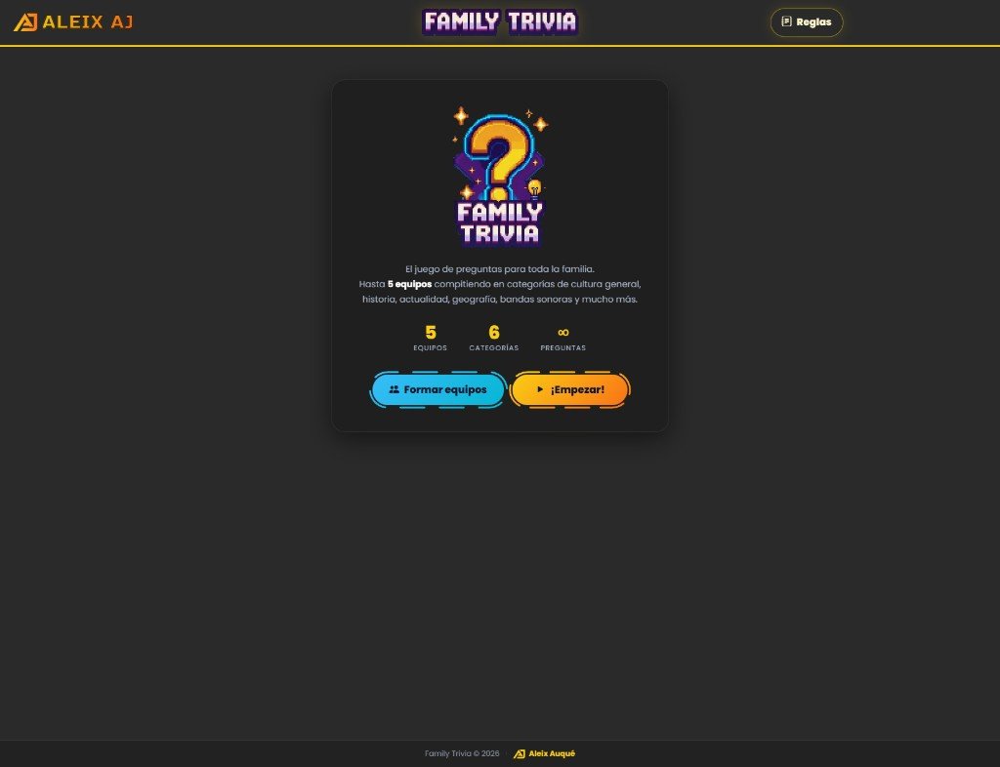
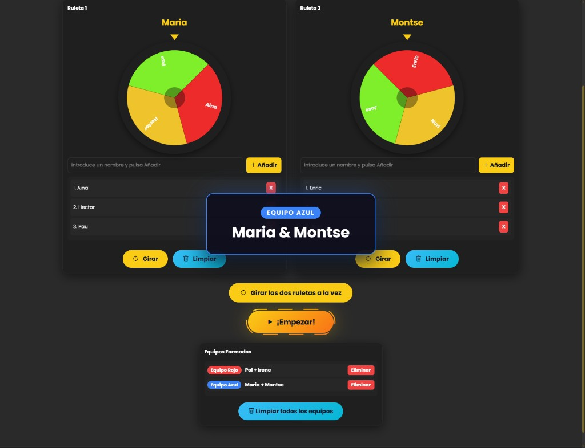
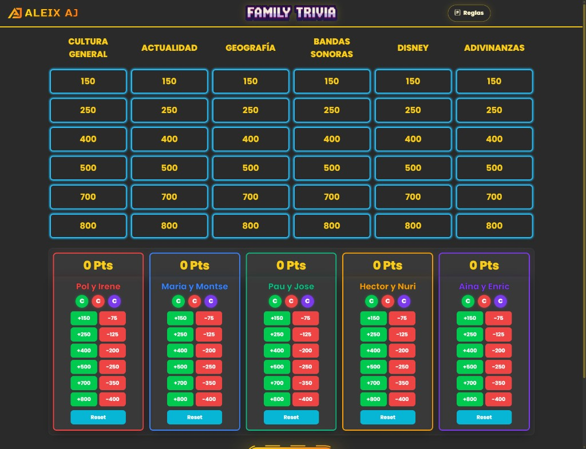
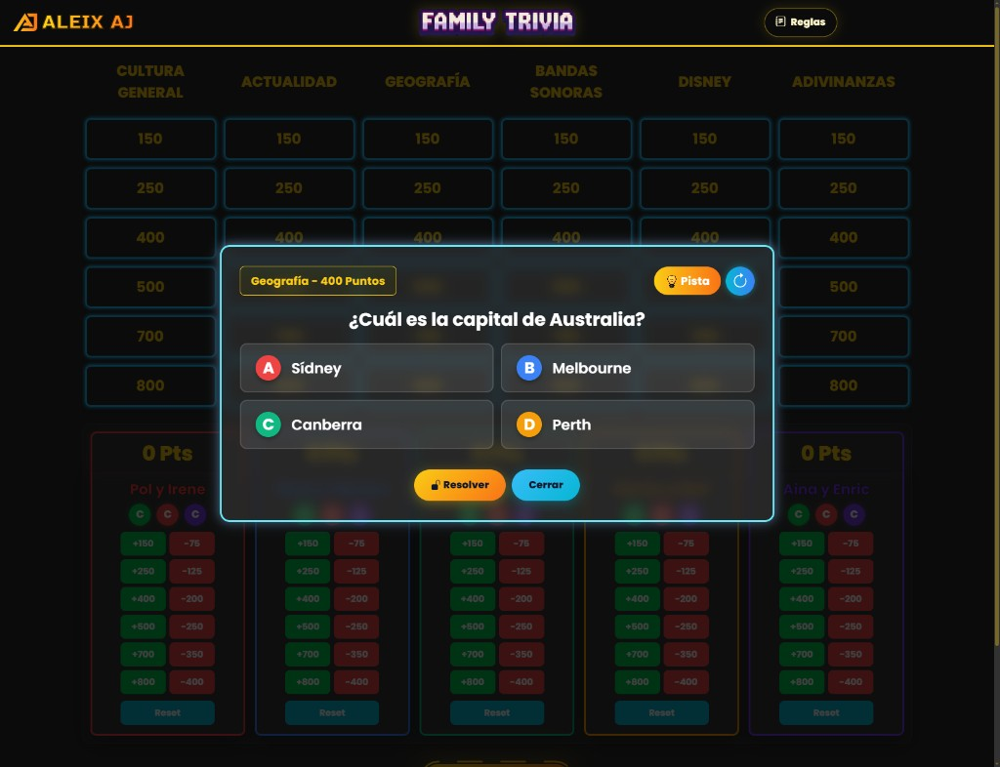
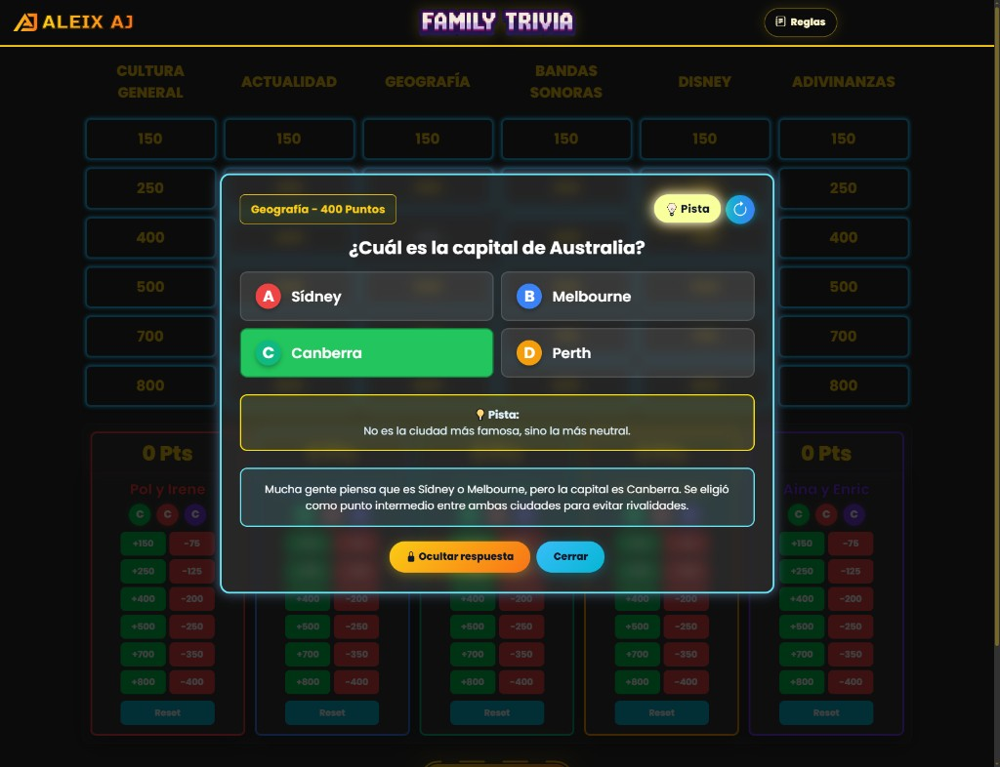
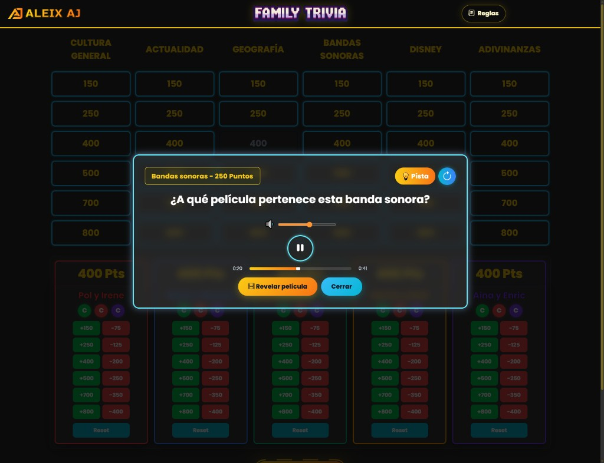
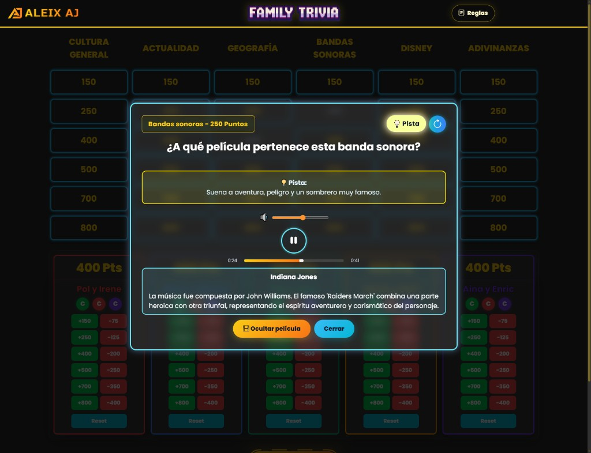
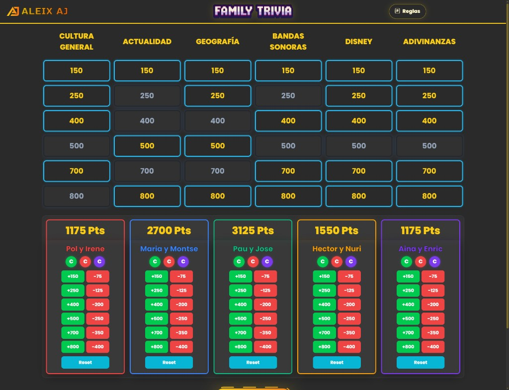
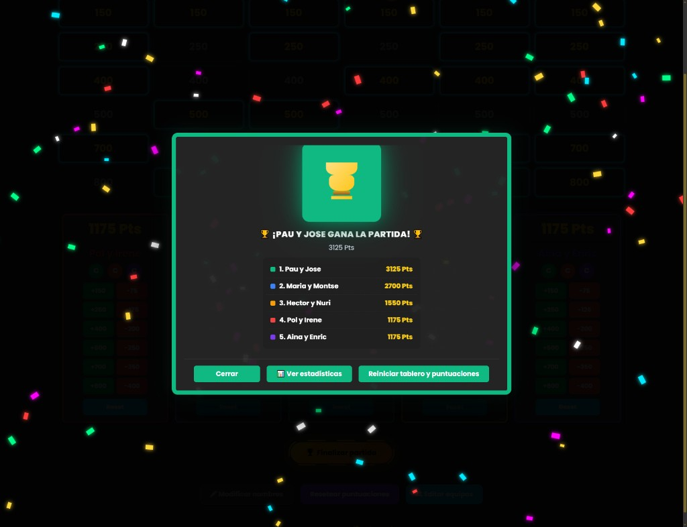
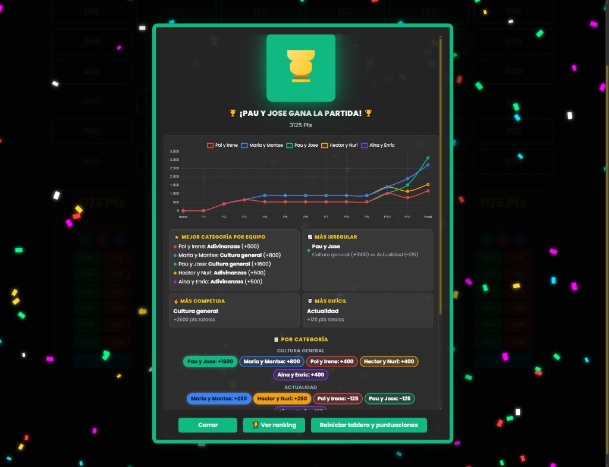

# FAMILY TRIVIA


Juego familiar de preguntas estilo tablero, pensado para jugar todos juntos en una casa, con un presentador dirigiendo la partida desde una tablet o pantalla visible para todos. Incluye ruletas para formar equipos equilibrados, preguntas por categorias, respuestas simultaneas, control manual de puntos y ranking final con estadisticas.

## Capturas de pantalla

Recorrido visual desde la pantalla de inicio hasta el ranking y las estadisticas finales.

### Pantalla de inicio



### Ruletas para formar equipos



### Tablero principal



### Pregunta tipo test



### Respuesta correcta resaltada, además tiene el panel abierto de pista y explicacion



### Pregunta de banda sonora (audio)



### Respuesta de banda sonora



### Partida en curso



### Fin de partida



### Estadisticas finales



## Entradas del juego

- `index.html`: tablero principal de Family Trivia.
- `ruletas.html`: pantalla de ruletas para formar equipos antes de empezar.

## Objetivo

El objetivo es conseguir la mayor puntuacion posible respondiendo preguntas de distintas categorias. En cada ronda, un equipo tiene la ventaja de escoger la categoria y la puntuacion, pero todos los equipos responden la pregunta a la vez.

Al terminar todo el tablero, se muestra un ranking final con el equipo ganador, confeti y estadisticas de rendimiento por equipo y categoria.

## Reglas

### Preparacion

El juego esta pensado para grupos familiares mezclados. Por ejemplo, si juegan 10 personas mas el presentador:

- 5 jovenes se escriben en la `Ruleta 1`.
- 5 mayores se escriben en la `Ruleta 2`.
- Las ruletas forman 5 parejas, mezclando un joven con un mayor.
- Cada pareja se convierte en un equipo.

Asi cada equipo combina conocimientos distintos y puede apoyarse mejor en preguntas de cultura general, actualidad, musica, Disney o adivinanzas.

### Equipos

- Pueden jugar hasta 5 equipos.
- Los equipos por defecto son Rojo, Azul, Verde, Amarillo y Morado.
- Los nombres se pueden cambiar desde el marcador usando el boton de editar.
- Si los equipos se forman desde `ruletas.html`, los nombres generados se trasladan automaticamente al tablero principal.
- Debe haber un presentador que abre preguntas, controla tiempos, revela respuestas y reparte puntos.
- Cada equipo necesita papel, pizarra o algo similar para escribir sus respuestas.

### Tablero

El tablero tiene 6 categorias:

- Cultura general
- Actualidad
- Geografia
- Bandas sonoras
- Disney
- Adivinanzas

Cada categoria tiene 6 niveles de puntuacion:

- 150 puntos
- 250 puntos
- 400 puntos
- 500 puntos
- 700 puntos
- 800 puntos

La dificultad aumenta segun el valor de la casilla:

- 150 y 250: dificultad facil.
- 400 y 500: dificultad media.
- 700 y 800: dificultad dificil.

### Dinamica de ronda

1. El equipo al que le toca escoge una categoria y una puntuacion disponible.
2. El presentador abre esa pregunta en la tablet o pantalla principal.
3. Todos los equipos piensan la respuesta al mismo tiempo.
4. Cada equipo escribe su respuesta en papel o pizarra.
5. Cuando el presentador lo indique, todos giran o muestran sus respuestas a la vez.
6. El presentador pulsa `Resolver` para mostrar la respuesta correcta o la explicacion.
7. El presentador suma o resta los puntos correspondientes a cada equipo.
8. La casilla queda marcada como usada y ya no se puede volver a escoger.

La ventaja del equipo que tiene el turno es elegir la casilla. La pregunta, sin embargo, la responden todos los equipos.

### Puntuacion

Cada casilla tiene un valor positivo y una penalizacion equivalente a la mitad de sus puntos:

- 150: acierto `+150`, fallo `-75`.
- 250: acierto `+250`, fallo `-125`.
- 400: acierto `+400`, fallo `-200`.
- 500: acierto `+500`, fallo `-250`.
- 700: acierto `+700`, fallo `-350`.
- 800: acierto `+800`, fallo `-400`.

Regla general:

- Cada equipo que acierta suma el valor completo de la casilla.
- Cada equipo que falla resta la mitad del valor de la casilla.
- En `Adivinanzas`, los fallos no restan puntos.

La puntuacion se controla manualmente desde los botones de cada equipo para que el presentador pueda aplicar estas reglas con flexibilidad.

### Preguntas con opciones

En las categorias de preguntas tipo test, los equipos escriben la opcion o respuesta que creen correcta. Al revelar, el presentador comprueba que equipos han acertado y reparte puntos.

### Comodines

Cada equipo tiene 3 comodines marcables:

- 🟢 Comodin verde: se usa antes de responder. El presentador ensena la pista solo a ese equipo.
- 🔴 Comodin rojo: se usa antes de responder. Si ese equipo falla la pregunta, no resta puntos.
- 🟣 Comodin morado: se usa antes de escribir la respuesta. Ese equipo puede leer las respuestas del resto antes de escribir la suya.

Reglas importantes:

- Cada comodin solo se puede usar una vez por equipo durante la partida.
- Si un equipo usa el comodin morado en una pregunta, ningun otro equipo puede usar su comodin morado en esa misma pregunta.
- Los comodines se usan antes de revelar la respuesta correcta.
- Cuando un equipo usa un comodin, el presentador lo marca en el panel de puntuaciones para que todos vean cuales le quedan disponibles.

### Preguntas musicales

Las categorias `Bandas sonoras` y `Disney` pueden incluir audios.

En estas preguntas:

- Se puede reproducir, pausar y mover la pista de audio.
- Los equipos escriben el nombre de la pelicula, serie o cancion que creen reconocer.
- El boton de revelar muestra la solucion cuando el presentador lo decida.

### Adivinanzas

Las adivinanzas no tienen opciones. Cada equipo escribe la respuesta que cree correcta.

Regla especial:

- Si un equipo acierta, suma los puntos de la casilla.
- Si un equipo falla, no resta puntos.

## Ruletas

La partida empieza normalmente en `ruletas.html`, donde se crean los equipos de forma aleatoria y equilibrada.

Funcionamiento:

1. Escribe un grupo de jugadores en la `Ruleta 1`, por ejemplo jovenes.
2. Escribe otro grupo de jugadores en la `Ruleta 2`, por ejemplo mayores.
3. Pulsa `Girar las dos ruletas a la vez`.
4. Se forma un equipo con una persona de cada ruleta.
5. Los nombres ganadores se eliminan de las ruletas.
6. Si solo queda una persona en cada ruleta, se emparejan automaticamente.
7. Cuando esten todos los equipos formados, pulsa `Empezar` para ir al tablero.

Los equipos formados se guardan temporalmente para pasar al tablero principal. Al recargar la pagina se limpian los equipos guardados.

## Interfaz

- El boton `Reglas` de la navbar abre un modal con las normas completas durante la partida.
- El logo `Family Trivia` de la navbar vuelve a la pagina principal.
- El enlace `Aleix AJ` y el logo del footer llevan al portfolio del autor.
- La interfaz esta adaptada para escritorio, tablet y movil, incluyendo tablero y panel de puntuaciones responsive.

## Estado de partida

Si el presentador entra en `Editar equipos` desde una partida en curso, el juego conserva el estado al volver:

- Puntuaciones.
- Casillas abiertas.
- Preguntas asignadas.
- Comodines usados.
- Estadisticas acumuladas para el ranking final.

Si se recarga la pagina con `F5`, se reinician la partida y los equipos guardados.

## Fin de partida

La partida termina cuando se han abierto todas las puntuaciones del tablero. Entonces el presentador pulsa el boton de finalizar partida para mostrar los resultados.

## Ranking final

El ranking final muestra:

- Equipo ganador.
- Puntuacion final de cada equipo.
- Grafico de evolucion de puntos.
- Mejor categoria por equipo.
- Categoria mas favorable y mas dificil.
- Estadisticas por categoria.

Desde la pantalla final tambien se puede reiniciar el tablero y las puntuaciones.

## Uso

No hace falta instalar dependencias.

Abre directamente:

- `index.html` para jugar.
- `ruletas.html` para formar equipos.

Tambien puedes desplegar la carpeta como proyecto estatico en cualquier servidor web.

## Estructura

```text
FamilyProject/
├── index.html
├── ruletas.html
├── css/
│   └── styles.css
├── js/
│   ├── script.js
│   ├── ruletas.js
│   └── footer.js
├── img/
└── audios/
```

## Editar preguntas

Las preguntas estan definidas en `js/script.js`, dentro de `questionPools`.

Cada pregunta puede incluir:

- `pregunta`: texto de la pregunta.
- `opciones`: respuestas posibles, si es una pregunta tipo test.
- `correcta`: indice de la opcion correcta.
- `explicacion`: texto que se muestra al resolver.
- `pista`: ayuda opcional.
- `audio`: ruta del archivo de audio, si es una pregunta musical.
- `trackName`: respuesta o explicacion de una pregunta musical.

Para cambiar categorias o valores del tablero, edita:

- `categories`: nombres de las categorias.
- `values`: puntuaciones disponibles.

## Notas

- El proyecto es independiente y mantiene sus propios archivos `css/`, `js/`, `img/` y `audios/`.
- Usa Bootstrap, Bootstrap Icons, Google Fonts y Chart.js desde CDN.
- Esta pensado para uso local, reuniones familiares o despliegue estatico sencillo.
- El footer incluye un enlace al portfolio de Aleix Auque usando el logo `AJ`.
