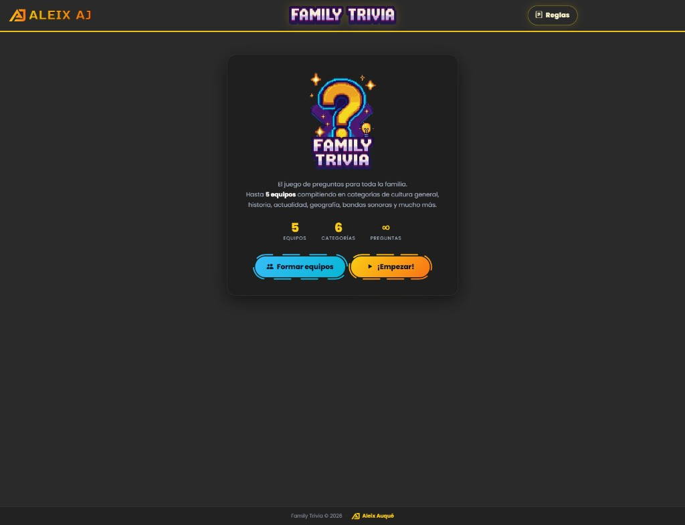
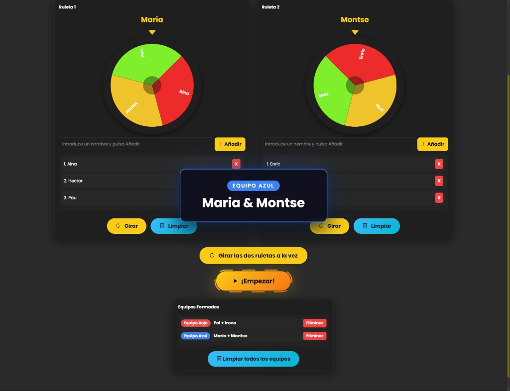
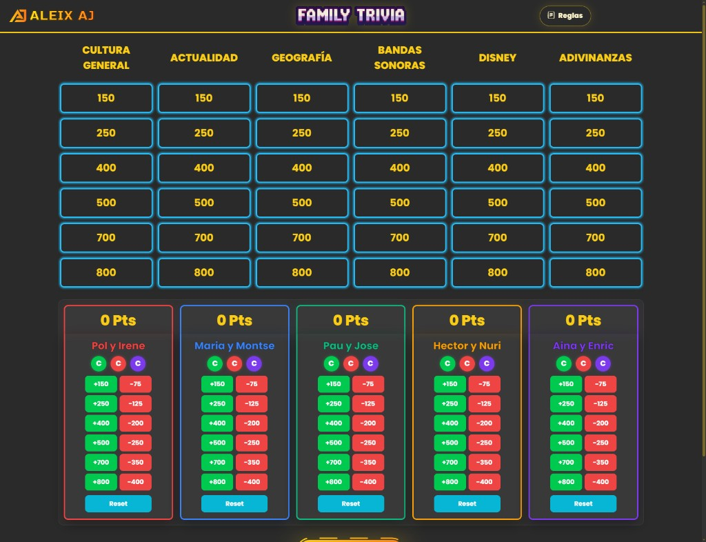
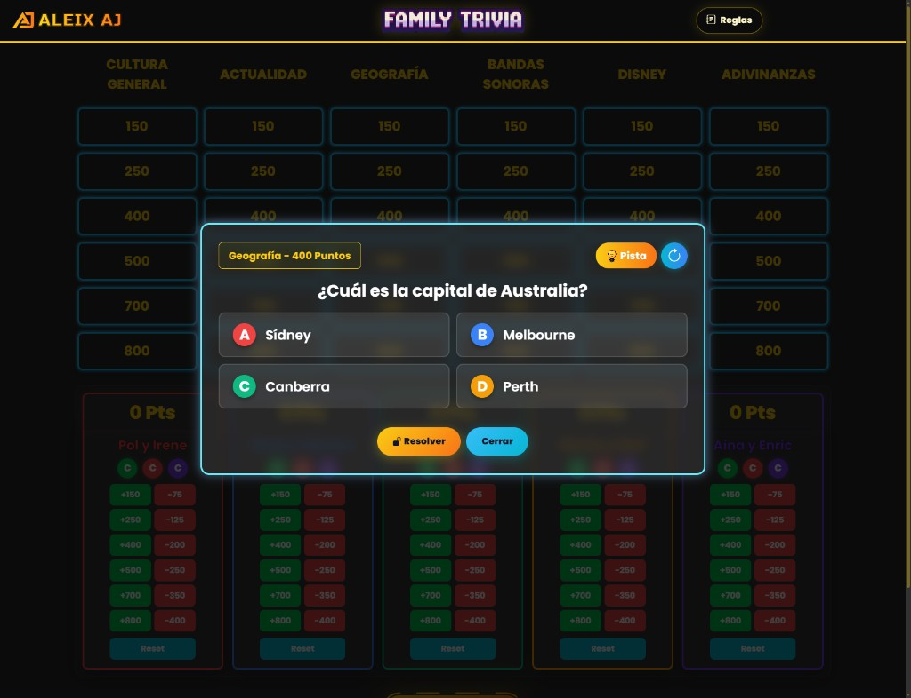
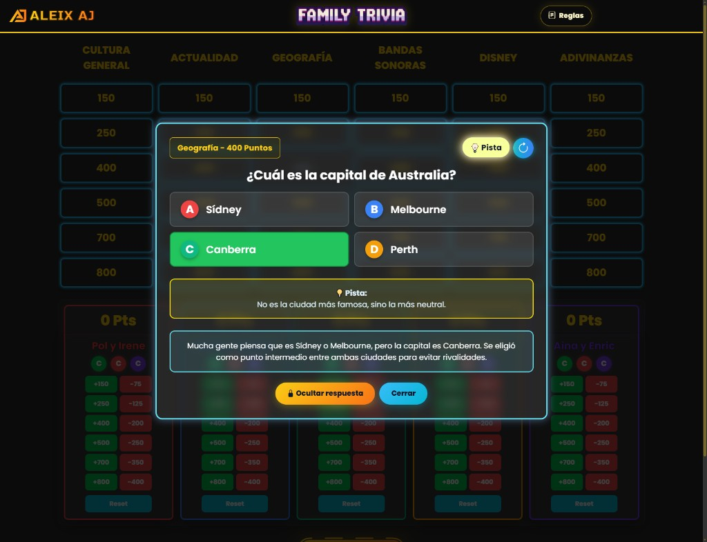
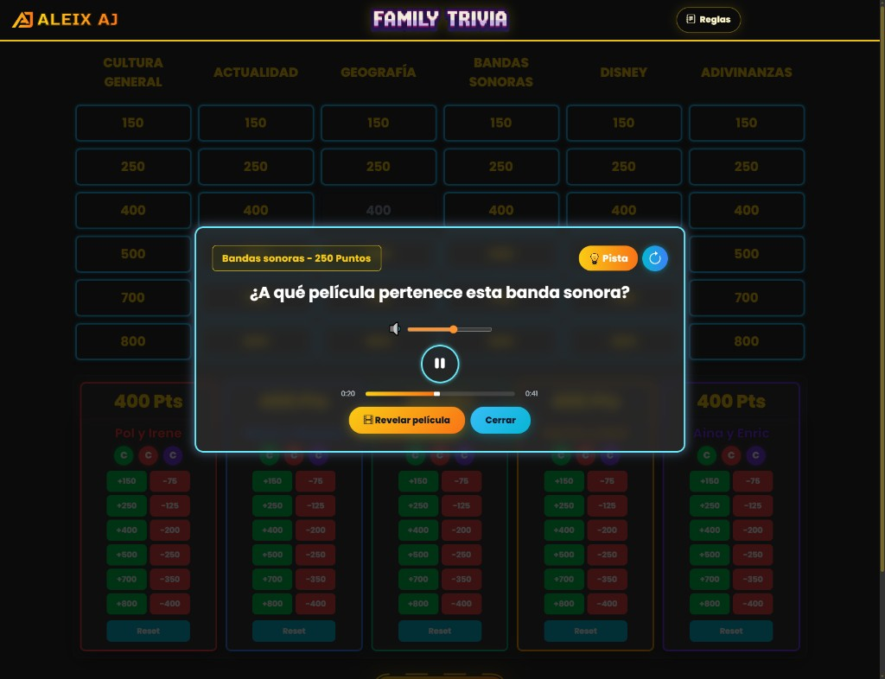
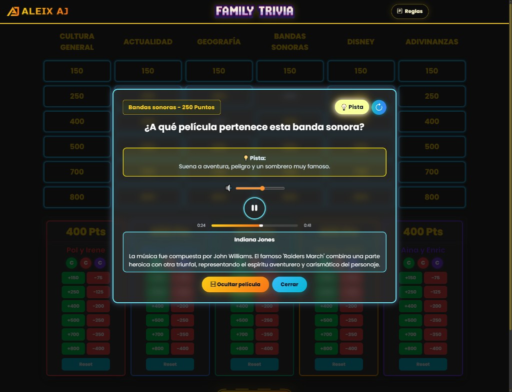
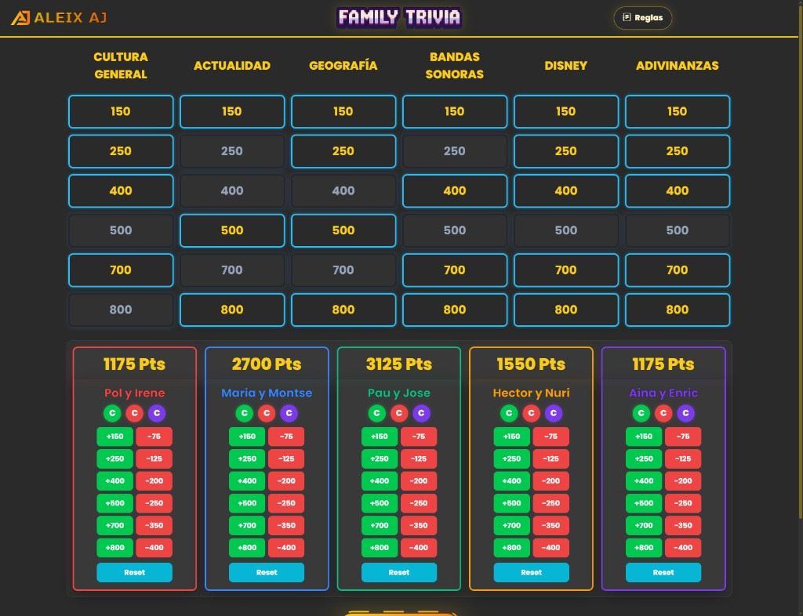
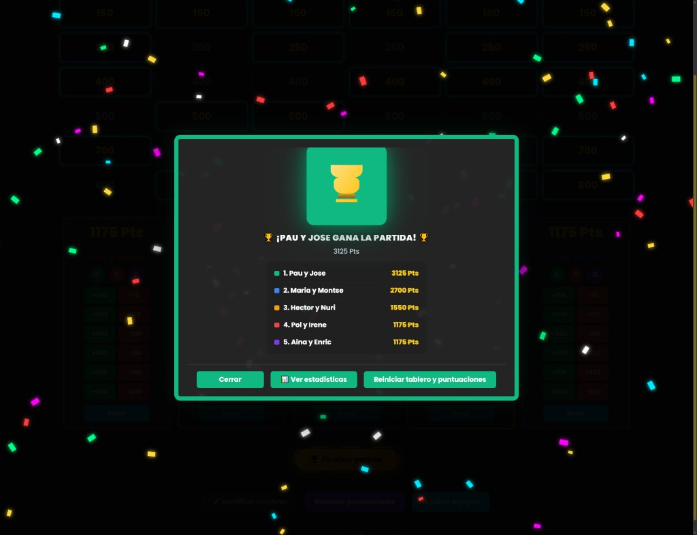
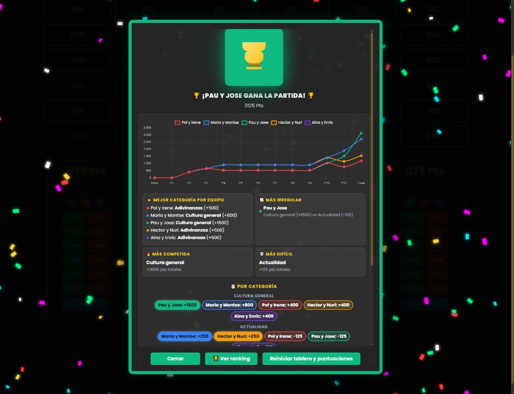

# FAMILY TRIVIA


<p>
  
  <a href="README.en.md"></a>
  <a href="README.ca.md"></a>
</p>

Juego familiar de preguntas estilo tablero, pensado para jugar todos juntos en una casa, con un presentador dirigiendo la partida desde una tablet o pantalla visible para todos. Se puede jugar solo, cada uno por su cuenta o por parejas formadas con las ruletas. Incluye preguntas por categorías, respuestas simultáneas, control manual de puntos y ranking final con estadísticas.

## Capturas de pantalla

Recorrido visual desde la pantalla de inicio hasta el ranking y las estadísticas finales.

### Pantalla de inicio



### Ruletas para formar equipos



### Tablero principal



### Pregunta tipo test



### Respuesta correcta resaltada, además tiene el panel abierto de pista y explicación



### Pregunta de banda sonora (audio)



### Respuesta de banda sonora



### Partida en curso



### Fin de partida



### Estadísticas finales



## Entradas del juego

- `index.html`: tablero principal de Family Trivia.
- `ruletas.html`: pantalla de ruletas para formar equipos antes de empezar.

## Objetivo

El objetivo es conseguir la mayor puntuación posible respondiendo preguntas de distintas categorías. En cada ronda, un equipo tiene la ventaja de escoger la categoría y la puntuación, pero todos los equipos responden la pregunta a la vez.

Al terminar todo el tablero, se muestra un ranking final con el equipo ganador, confeti y estadísticas de rendimiento por equipo y categoría.

## Modos de juego

Al abrir el juego se elige uno de los tres modos:

- **Un jugador**: se pide el nombre y se juega solo, con una única tarjeta de puntuación.
- **Multijugador individual**: se indica cuántas personas juegan (de 2 a 15) y el nombre de cada una. Cada persona tiene su propia tarjeta.
- **Multijugador por parejas**: lleva a `ruletas.html`, donde se forman las parejas. Cada pareja se convierte en una tarjeta con los dos nombres, hasta 15 parejas (30 personas).

En todos los modos las tarjetas del marcador se generan según el número real de participantes: hasta cinco por fila en escritorio, y las siguientes pasan a la fila de abajo.

## Reglas

### Preparación

El juego está pensado para grupos familiares mezclados. Por ejemplo, si juegan 10 personas más el presentador:

- 5 jóvenes se escriben en la `Ruleta 1`.
- 5 mayores se escriben en la `Ruleta 2`.
- Las ruletas forman 5 parejas, mezclando un joven con un mayor.
- Cada pareja se convierte en un equipo.

Así cada equipo combina conocimientos distintos y puede apoyarse mejor en preguntas de cultura general, actualidad, música, Disney o adivinanzas.

### Equipos

- Pueden jugar hasta 15 equipos o jugadores, tres filas de cinco tarjetas en escritorio.
- Los cinco primeros mantienen los colores clásicos (Rojo, Azul, Verde, Amarillo y Morado) y a partir del sexto se usan rosa, cian, naranja, lima, índigo, turquesa, magenta, cielo, coral y menta.
- Sin nombres propios, las tarjetas se llaman `Jugador 1`, `Jugador 2`... en modo individual, y `Equipo Rojo`, `Equipo Azul`... en modo por parejas.
- Los nombres se pueden cambiar en cualquier momento desde el marcador usando el botón de editar.
- Si los equipos se forman desde `ruletas.html`, los nombres generados se trasladan automáticamente al tablero principal.
- Debe haber un presentador que abre preguntas, controla tiempos, revela respuestas y reparte puntos.
- Cada equipo necesita papel, pizarra o algo similar para escribir sus respuestas.

### Tablero

El tablero tiene 6 categorías:

- Cultura general
- Actualidad
- Geografía
- Bandas sonoras
- Disney
- Adivinanzas

Cada categoría tiene 6 niveles de puntuación:

- 150 puntos
- 250 puntos
- 400 puntos
- 500 puntos
- 700 puntos
- 800 puntos

La dificultad aumenta según el valor de la casilla:

- 150 y 250: dificultad fácil.
- 400 y 500: dificultad media.
- 700 y 800: dificultad difícil.

### Progreso del tablero

Junto a la barra de turno hay un contador de casillas jugadas (por ejemplo `14/36`). Al jugar la última, el juego avisa de que se puede finalizar la partida.

### Turnos

Encima del tablero hay una barra que indica de qué equipo es el turno, resaltando además su tarjeta en el marcador. El turno pasa solo al siguiente equipo cuando se cierra una pregunta ya resuelta, y el presentador puede corregirlo o saltarlo con las flechas. En el modo de un jugador la barra no aparece.

### Dinámica de ronda

1. El equipo al que le toca escoge una categoría y una puntuación disponible.
2. El presentador abre esa pregunta en la tablet o pantalla principal.
3. Todos los equipos piensan la respuesta al mismo tiempo.
4. Cada equipo escribe su respuesta en papel o pizarra.
5. Cuando el presentador lo indique, todos giran o muestran sus respuestas a la vez.
6. El presentador pulsa `Resolver` para mostrar la respuesta correcta o la explicación.
7. El presentador suma o resta los puntos correspondientes a cada equipo.
8. Al cerrar la pregunta se abre la pantalla de reparto con la respuesta correcta y los equipos.
9. La casilla queda marcada como usada y ya no puntúa, aunque se puede volver a abrir para repasar la respuesta.

La ventaja del equipo que tiene el turno es elegir la casilla. La pregunta, sin embargo, la responden todos los equipos.

### Puntuación

Cada casilla tiene un valor positivo y una penalización equivalente a la mitad de sus puntos:

- 150: acierto `+150`, fallo `-75`.
- 250: acierto `+250`, fallo `-125`.
- 400: acierto `+400`, fallo `-200`.
- 500: acierto `+500`, fallo `-250`.
- 700: acierto `+700`, fallo `-350`.
- 800: acierto `+800`, fallo `-400`.

Regla general:

- Cada equipo que acierta suma el valor completo de la casilla.
- Cada equipo que falla resta la mitad del valor de la casilla.
- En `Adivinanzas`, los fallos no restan puntos.

Hay dos formas de repartir puntos:

- **Pantalla de reparto** (se abre al cerrar la pregunta): muestra arriba la respuesta correcta, con su letra y su texto, y debajo una fila por equipo con un botón grande de acierto y otro de fallo, pensados para pulsar en tablet. Al marcarlos se aplica automáticamente el valor de la casilla, la mitad en negativo si falla, y nada si es una adivinanza. Volver a pulsar la misma marca la quita y devuelve los puntos, y cambiar de acierto a fallo recalcula la diferencia sin acumular. `Ver la pregunta` vuelve al enunciado y `Listo` cierra la ronda y pasa el turno.
- **Botones de cada tarjeta**: quedan ocultos tras el botón `Ajustar puntos`, que despliega un panel flotante sobre la tarjeta con las sumas, las restas y el reset. Sirve para correcciones sueltas; en las estadísticas por categoría esos puntos se atribuyen a la última pregunta abierta. Solo se puede tener un panel abierto a la vez y se cierra al pulsar fuera o con `Escape`.

Si se cambia la pregunta de una casilla donde ya se habían repartido puntos, esos puntos se devuelven automáticamente, porque esa pregunta deja de jugarse.

El botón **Deshacer turno** (o `Ctrl+Z`) revierte el último cambio de puntuación, venga del reparto asistido o de los botones manuales, y también deshace la marca de acierto o fallo correspondiente.

### Preguntas con opciones

En las categorías de preguntas tipo test, los equipos escriben la opción o respuesta que creen correcta. Al revelar, el presentador comprueba qué equipos han acertado y reparte puntos.

### Comodines

Cada equipo tiene 3 comodines marcables:

- 🟡 Comodín amarillo: se usa antes de responder. El presentador enseña la pista solo a ese equipo.
- 🔴 Comodín rojo: se usa antes de responder. Si ese equipo falla la pregunta, no resta puntos.
- ⚪ Comodín blanco: se usa antes de escribir la respuesta. Ese equipo puede leer las respuestas del resto antes de escribir la suya.

Reglas importantes:

- Cada comodín solo se puede usar una vez por equipo durante la partida.
- Si un equipo usa el comodín blanco en una pregunta, ningún otro equipo puede usar su comodín blanco en esa misma pregunta.
- Los comodines se usan antes de revelar la respuesta correcta.
- Cuando un equipo usa un comodín, el presentador lo marca en el panel de puntuaciones para que todos vean cuáles le quedan disponibles.

### Preguntas musicales

Las categorías `Bandas sonoras` y `Disney` pueden incluir audios.

En estas preguntas:

- Se puede reproducir, pausar y mover la pista de audio.
- La barra de progreso del reproductor admite tanto **clic** para saltar a un punto como **arrastre** con ratón o dedo (compatible con dispositivos táctiles gracias a `pointer events` y `touch-action: none`).
- Los equipos escriben el nombre de la película, serie o canción que creen reconocer.
- El botón de revelar muestra la solución cuando el presentador lo decida.

### Adivinanzas

Las adivinanzas no tienen opciones. Cada equipo escribe la respuesta que cree correcta.

Regla especial:

- Si un equipo acierta, suma los puntos de la casilla.
- Si un equipo falla, no resta puntos.

## Ruletas

La partida empieza normalmente en `ruletas.html`, donde se crean los equipos de forma aleatoria y equilibrada.

Funcionamiento:

1. Escribe un grupo de jugadores en la `Ruleta 1`, por ejemplo jóvenes.
2. Escribe otro grupo de jugadores en la `Ruleta 2`, por ejemplo mayores.
3. Pulsa `Girar las dos ruletas a la vez`.
4. Se forma un equipo con una persona de cada ruleta.
5. Los nombres ganadores se eliminan de las ruletas.
6. Si solo queda una persona en cada ruleta, se emparejan automáticamente.
7. Cuando estén todos los equipos formados, pulsa `¡Empezar!` para ir al tablero.

Al pulsar `¡Empezar!` se cuentan las parejas de la tabla `Equipos Formados` y se crea una tarjeta por pareja, con los dos nombres. Si no hay ninguna pareja formada, se entra con los cinco equipos por defecto.

Los equipos formados se guardan en el navegador para pasar al tablero principal y siguen ahí aunque se cierre la pestaña. Al recargar la página con `F5` el juego pregunta antes de borrarlos.

## Interfaz

- El botón `Reglas` de la navbar abre un modal con las normas completas durante la partida.
- El logo `Family Trivia` de la navbar vuelve a la página principal.
- El enlace `Aleix AJ` y el logo del footer llevan al portfolio del autor. Se muestran con el gradiente azul cian del portfolio (`#a5f3fc -> #22d3ee -> #0891b2`), igual que el logo de la navbar, para reforzar la identidad de marca.
- La interfaz está adaptada para escritorio, tablet y móvil, incluyendo tablero y panel de puntuaciones responsive.
- Animaciones cuidadas en momentos clave: apertura y cierre de pregunta, opciones que entran escalonadas, feedback de respuesta (acierto / fallo), sello en casillas usadas, pulso del marcador al sumar o restar puntos y entrada animada del ranking final con `count-up` del ganador.
- Las ruletas también tienen feedback animado: cada nombre nuevo entra con una pequeña animación, el ganador hace un pulso al revelarse y los equipos formados se añaden con una transición clara.
- Toda la capa de animaciones respeta `prefers-reduced-motion`, así que se desactivan automáticamente si el sistema operativo lo pide.
- El tablero se puede manejar con teclado: `Tab` recorre las casillas, `Enter` o `Espacio` abren la pregunta y `Escape` cierra la pregunta o el ranking. Cada casilla anuncia su categoría y sus puntos para lectores de pantalla.

## Estado de partida

Si el presentador entra en `Editar equipos` desde una partida en curso, el juego conserva el estado al volver:

- Puntuaciones.
- Casillas abiertas.
- Preguntas asignadas.
- Comodines usados.
- Turno actual y aciertos o fallos ya marcados en cada casilla.
- Estadísticas acumuladas para el ranking final.

Si se cambia el número de parejas o de jugadores, la partida empieza de cero porque el tablero anterior ya no encaja con las nuevas tarjetas.

La partida se guarda en el navegador del dispositivo que hace de presentador, no en un servidor, y sobrevive a cerrar la pestaña e incluso a cerrar el navegador: al volver a abrir el juego aparece un aviso para continuar donde lo dejasteis o empezar de nuevo. Lo mismo pasa al recargar con `F5`, y en `ruletas.html` con las parejas ya formadas.

Como se guarda por dispositivo y navegador, la partida solo reaparece en el mismo sitio donde se estaba jugando. Borrar los datos del navegador o jugar en modo incógnito sí la borra.

## Fin de partida

La partida termina cuando se han abierto todas las puntuaciones del tablero. Entonces el presentador pulsa el botón de finalizar partida para mostrar los resultados.

## Ranking final

El ranking final muestra:

- Equipo ganador.
- Puntuación final de cada equipo.
- Gráfico de evolución de puntos.
- Mejor categoría por equipo.
- Categoría más favorable y más difícil.
- Estadísticas por categoría.

Desde la pantalla final también se puede reiniciar el tablero y las puntuaciones.

## Uso

No hace falta instalar dependencias.

Abre directamente:

- `index.html` para jugar.
- `ruletas.html` para formar equipos.

También puedes desplegar la carpeta como proyecto estático en cualquier servidor web.

## Estructura

```text
FamilyProject/
├── index.html
├── ruletas.html
├── css/
│   └── styles.css
├── js/
│   ├── questions.js
│   ├── script.js
│   ├── ruletas.js
│   └── footer.js
├── vendor/
│   ├── bootstrap/
│   ├── bootstrap-icons/
│   ├── chart/
│   └── fonts/
├── sw.js
├── img/
└── audios/
```

## Editar preguntas

Las preguntas están definidas en `js/questions.js`, dentro de `questionPools`, para que sea más fácil modificarlas sin tocar la lógica del juego.

Cada pregunta puede incluir:

- `pregunta`: texto de la pregunta.
- `opciones`: respuestas posibles, si es una pregunta tipo test.
- `correcta`: índice de la opción correcta.
- `explicacion`: texto que se muestra al resolver.
- `pista`: ayuda opcional.
- `audio`: ruta del archivo de audio, si es una pregunta musical.
- `trackName`: respuesta o explicación de una pregunta musical.

Para cambiar categorías o valores del tablero, edita:

- `categories`: nombres de las categorías.
- `values`: puntuaciones disponibles.

El archivo `index.html` carga primero `js/questions.js` y después `js/script.js`, así que el orden de esos scripts es importante.

## Funciona sin conexión

Todas las librerías están servidas desde el propio proyecto, en `vendor/`: Bootstrap, Bootstrap Icons (con sus fuentes), Chart.js y las tipografías Poppins y Russo One (subconjuntos latin y latin-ext). La página no hace ninguna petición a servidores externos.

Además, `sw.js` guarda el juego en el navegador la primera vez que se abre, así que después se puede jugar aunque no haya conexión: tablero, preguntas, marcador, ruletas y estadísticas. Lo único que necesita red son los audios de `Bandas sonoras` y `Disney`, que pesan demasiado para guardarlos; si no cargan, el juego avisa y se puede cambiar de pregunta.

Las páginas se piden siempre a la red primero y solo se sirven desde la copia guardada si no hay conexión, de modo que los cambios publicados llegan igual.

Al publicar cambios en `css/` o `js/` hay que subir el `?v=` que llevan los `<link>` y `<script>` de `index.html` y `ruletas.html`: esa parte de la dirección es lo que obliga al navegador a descargar el archivo nuevo en vez de reutilizar el suyo. Conviene poner el mismo `?v=` en la lista `PRECACHE` de `sw.js` y subir también el número de `CACHE`, para que los dispositivos descarten la copia anterior.

## Notas

- El proyecto es independiente y mantiene sus propios archivos `css/`, `js/`, `img/`, `audios/` y `vendor/`.
- Está pensado para uso local, reuniones familiares o despliegue estático sencillo.
- El footer incluye un enlace al portfolio de Aleix Auque usando el logo `AJ` con el gradiente azul cian del portfolio.
- Las animaciones se desactivan automáticamente para usuarios con `prefers-reduced-motion: reduce`, mejorando la accesibilidad sin perder el efecto visual para el resto.
- Los scripts se cargan con `defer` manteniendo su orden, todas las librerías y fuentes se sirven desde `vendor/` (sin `preconnect` ni peticiones a Google Fonts o a un CDN), y las imágenes que no se ven al entrar se cargan solo cuando hacen falta.
- El pulso de neón del tablero se anima por opacidad sobre un pseudo-elemento en lugar de animar `box-shadow` en las 36 casillas, que obligaba a repintar el tablero en cada fotograma.
